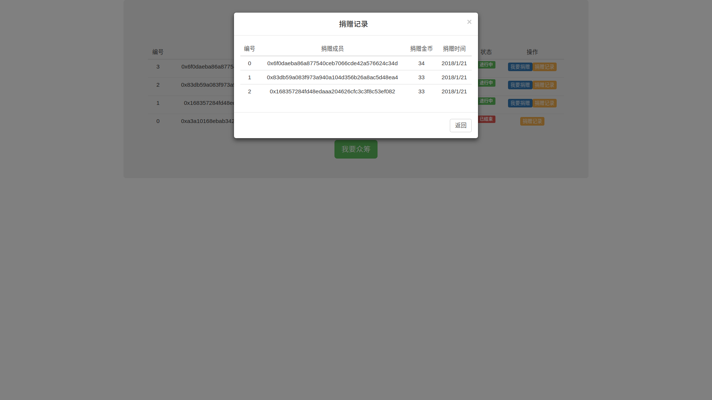

# 以太坊众筹系统

## 准备工作
`learn` 环境搭建 & Web3j 轻量级的以太坊开发库for Java:
https://github.com/littleredhat1997/Ethereum

## 项目说明
1. 发起众筹

2. 发送金币

3. 捐赠记录

4. 众筹项目

其它注意：钱包要有钱(支付gas) 记得挖矿 等待确认 ......

## 项目环境
1. IntelliJ IDEA 2017 (org.apache.maven.archetypes:maven-archetype-webapp)
2. Apache Tomcat 8.5.16
3. Geth 1.7.3

## 项目运行
1. 部署 crowdfunding.sol 合约
```
# 参考 https://github.com/littleredhat1997/Ethereum
# 部署合约方式一 - wallet 部署
# 部署合约方式二 - geth 部署
# 部署合约方式三 - web3j 部署
# 记录合约地址
```
2. 导入 crowdfunding 工程
```
File -> new -> Module from Existing Sources... -> 选中pom.xml文件 -> 一直next
```
3. 配置 config.properties 数据
4. 启动服务器 http://localhost:8080/crowdfunding/index.html

## 项目重点
1. `optimize` 以太坊写入速度太慢影响用户体验
	1. 对于需要查询的事务，采用对象池加载服务
	2. 对于需要执行的事务，采用异步请求事务
```
note:
src/main/resources/config.properties 配置文件
help:
--com.redhat.crowdfunding.util 工具包
----Consts.java 常量类
----Utils.java 工具类
--com.redhat.crowdfunding.model 模型类
----Fund.java 众筹项目
----Record.java 捐赠记录
--com.redhat.crowdfunding.contract 合约类
----CrowdFundingInterface.java HelloWorld 接口
----CrowdFundingContract.java HelloWorld 实现
----CrowdFundingMain.java HelloWorld 部署
--com.redhat.crowdfunding.service 服务类
----CrowdFundingService.java 接口
----CrowdFundingServiceImpl.java 实现
--com.redhat.crowdfunding.pool 对象池
----CrowdFundingServicePool.java
--com.redhat.crowdfunding.controller 控制器
----CrowdFundingController.java
```
